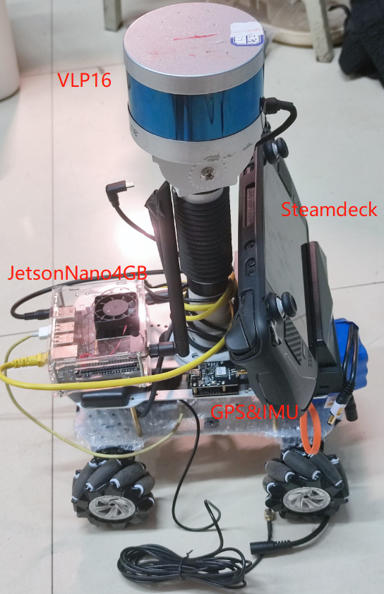
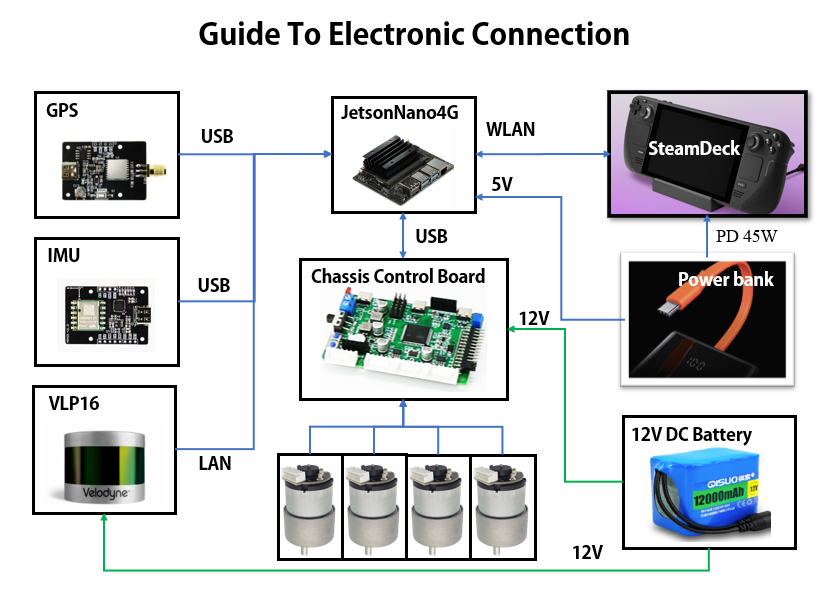

# Steam_Autoware_Hardware
## 1. Introduction
This folder provides the hardware  device, which is used for sampling data and run the [*Autoware*](https://github.com/autowarefoundation/autoware) projects or [*Others*](https://github.com/ros-perception/slam_gmapping)


I release the all of my hardware compositions.


## 2. Guide to installation
### 1.1 Assembly instruction
The assembly instructions are shown in the following figure.
<div align="center">

</div>


### 1.2 Electronic connection
The guide of electronic connection is shown as follow:
<div align="center">
    
</div>


<!-- 
## 3. Material lists (only for reference)
| Item  | Pics  | Purchasing list <br> (available is <br>  not guaranteed)  |
| :------------: | :------------: | :------------: |
| Velodyne LiDAR  |   | [Livox tech](https://www.livoxtech.com/); [DJI store](https://store.dji.com/hk-en/product/livox-avia) |
| Phantom 4 Intelligent <br>  Flight Battery  |  |   [DJI](https://store.dji.com/product/phantom-4-pro-intelligent-battery-high-capacity?from=search-result-v2&position=1)|
| FLIR camera <br> Blackfly BFS-u3-13y3c|  | [FLIR](https://www.flir.com/)|
| Camera lens |  | [TaoBao](https://item.taobao.com/item.htm?spm=a1z09.2.0.0.513c2e8daXJAWH&id=574262885542&_u=srntq1l7258) |
| Battery power <br> management unit |  | [TaoBao](https://item.taobao.com/item.htm?spm=a1z09.2.0.0.67002e8damYNUc&id=530629049456&_u=6rntq1l7cf6) |
| DJI D-GPS RTK <br> **(Optional)**  |  | [DJI](https://www.dji.com/hk-en/d-rtk) |


## 5. License
The source code is released under [GPLv2](http://www.gnu.org/licenses/) license. 

If you use any code of this repo in your academic research, it will be **very very appreciated** if you can cite any of our following papers:
```
[1] Lin, Jiarong, and Fu Zhang. "R3LIVE: A Robust, Real-time, RGB-colored, LiDAR-Inertial-Visual tightly-coupled state Estimation and mapping package." 
[2] Lin, Jiarong, et al. "R2LIVE: A Robust, Real-time, LiDAR-Inertial-Visual tightly-coupled state Estimator and mapping." 
```
For any technical issues, please contact me via email Jiarong Lin < ziv.lin.ljr@gmail.com > 

For commercial use, please contact Dr. Fu Zhang < fuzhang@hku.hk > and me < ziv.lin.ljr@gmail.com >. -->